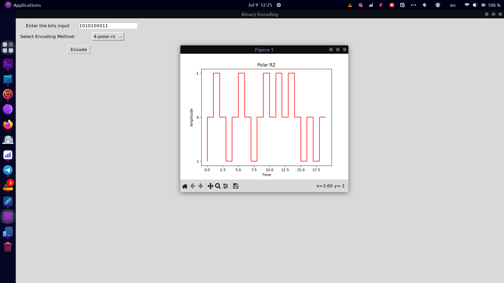
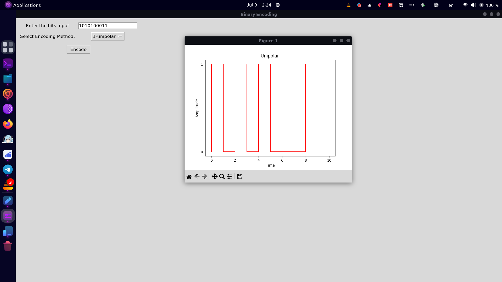
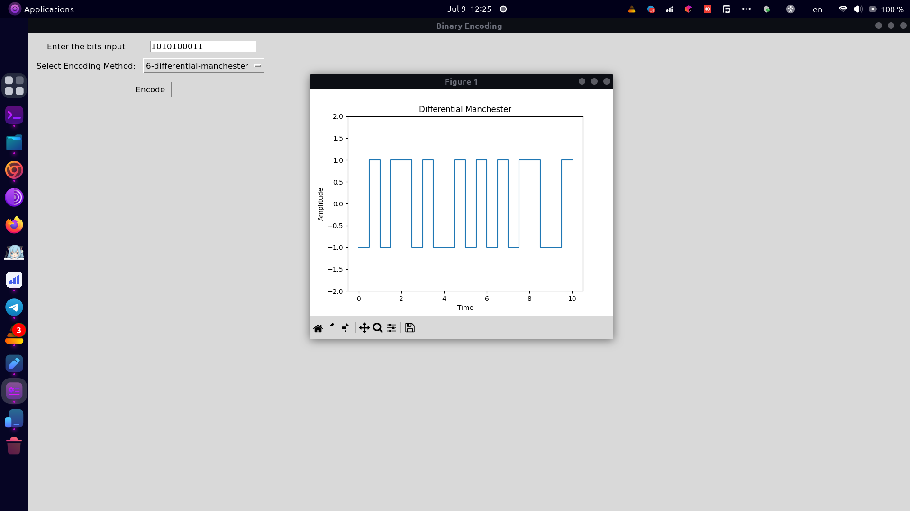

# Binary Encoding Visualization

This project is a Python GUI application designed to visualize various binary encoding schemes. It allows users to input a binary sequence and choose an encoding method to generate a visual representation of the encoded signal.

## Features

- **Unipolar Encoding**
- **Polar NRZ-L Encoding**
- **Polar NRZ-I Encoding**
- **Polar RZ Encoding**
- **Biphase Manchester Encoding**
- **Differential Manchester Encoding**
- **AMI (Alternate Mark Inversion) Encoding**

## Requirements

- Python 3.x
- NumPy
- Matplotlib
- Tkinter

## Installation

1. Clone the repository:

```sh
git clone https://github.com/yourusername/binary-encoding-visualization.git
cd binary-encoding-visualization
```

2. Install the required Python packages:

```sh
pip install numpy matplotlib
```

## Usage

Run the script to launch the GUI:

```sh
python main.py
```

1. Enter a binary sequence in the input field.
2. Select an encoding method from the dropdown menu.
3. Click the "Encode" button to generate and display the encoded signal.

## Screenshot






## Encoding Methods

- **Unipolar**: Represents binary `1` as high and `0` as low.
- **Polar NRZ-L**: Non-return-to-zero level encoding; `1` is high and `0` is low.
- **Polar NRZ-I**: Non-return-to-zero inverted encoding; `1` causes a transition, `0` does not.
- **Polar RZ**: Return-to-zero encoding; each bit returns to zero in the middle of the bit period.
- **Biphase Manchester**: Each bit is represented by a transition in the middle of the bit period; `0` is low-to-high, `1` is high-to-low.
- **Differential Manchester**: Each bit is represented by a transition in the middle; `0` is no transition at the beginning of the bit period, `1` is a transition.
- **AMI (Alternate Mark Inversion)**: `0` is represented by no line signal, `1` alternates between positive and negative voltages.

## License

This project is licensed under the MIT License. See the [LICENSE](LICENSE) file for details.

## Contributing

Contributions are welcome! Please open an issue or submit a pull request.

## Author

[Esmail Sarhadi](https://github.com/esmail-sarhadi)

## Acknowledgements

- Thanks to the developers of NumPy, Matplotlib, and Tkinter for their excellent libraries.
